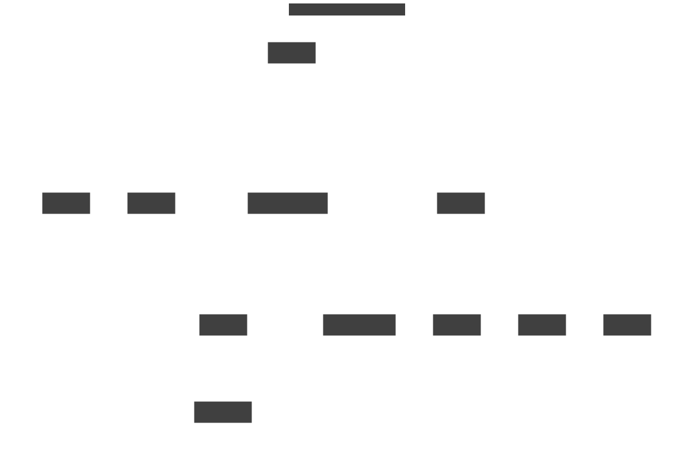

# Application concept

An application is a set of [components](component.html) that work
together.  A Skupper [network](network.html) is dedicated to one
application.

<figure>
  
  <figcaption>The application model</figcaption>
</figure>

An application has one or more components.

<figure>
  
  <figcaption>A simple application with two components</figcaption>
</figure>

<figure>
  
  <figcaption>The components of the Online Boutique example application</figcaption>
</figure>
