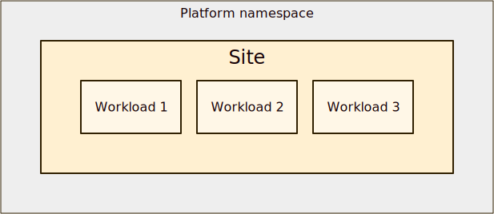
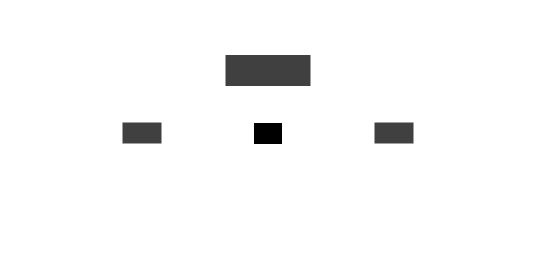

# Skupper concepts

## Concept index

#### Sites

<table class="objects">
<tr><th><a href="{{site.prefix}}/concepts/site.html">Site</a></th><td>A site is a place on the network where application workloads are running</td></tr>
<tr><th><a href="{{site.prefix}}/concepts/workload.html">Workload</a></th><td>A workload is a set of processes running on a platform</td></tr>
<tr><th><a href="{{site.prefix}}/concepts/platform.html">Platform</a></th><td>A platform is a system for running application workloads</td></tr>
</table>

#### Networks

<table class="objects">
<tr><th><a href="{{site.prefix}}/concepts/network.html">Network</a></th><td>A network is a set of sites joined by links</td></tr>
<tr><th><a href="{{site.prefix}}/concepts/link.html">Link</a></th><td>A link is a channel for communication between sites</td></tr>
<tr><th><a href="{{site.prefix}}/concepts/access-token.html">Access token</a></th><td>An access token is a short-lived credential used to create a link</td></tr>
</table>

#### Services

<table class="objects">
<tr><th><a href="{{site.prefix}}/concepts/listener.html">Listener</a></th><td>A listener binds a local connection endpoint to connectors in remote sites</td></tr>
<tr><th><a href="{{site.prefix}}/concepts/connector.html">Connector</a></th><td>A connector binds a local workload to listeners in remote sites</td></tr>
<tr><th><a href="{{site.prefix}}/concepts/routing-key.html">Routing key</a></th><td>A routing key is a string identifier for matching listeners and connectors</td></tr>
</table>

#### Applications

<table class="objects">
<tr><th><a href="{{site.prefix}}/concepts/application.html">Application</a></th><td>An application is a set of components that work together</td></tr>
<tr><th><a href="{{site.prefix}}/concepts/component.html">Component</a></th><td>A component is a logical part of an application</td></tr>
</table>

## Overview

<figure>
  
  <figcaption>The primary concepts in the Skupper model</figcaption>
</figure>

#### Sites

Skupper's job is to provide connectivity for applications that have
parts running in multiple locations and on different platforms.  A
[site](site.html) represents a particular location and a particular
[platform](platform.html).  It's a place where you have real running
[workloads](workload.html).  Each site corresponds to one platform
namespace, so you can have multiple sites on one platform.

<figure>
  
  <figcaption>A site with three workloads</figcaption>
</figure>

#### Networks

In a distributed application, those workloads need to communicate with
other workloads in other sites.  Skupper uses [links](link.html)
between sites to provide site-to-site communication.  Links are always
secured using mutual TLS authentication and encryption.

When a set of sites are linked, they function as one
application-focused [network](network.html).  You can use short-lived
[access tokens](access-token.html) to securely create links.

<figure>
  
  <figcaption>A simple network with two sites</figcaption>
</figure>

#### Services

Site-to-site links are distinct from application connections.  Links
form the transport for your network. Application connections are
carried on top of this transport. Application connections can be
established in any direction and to any site, regardless of how the
underlying links are established.

Services are exposed on the network by creating corresponding
[listeners](listener.html) and [connectors](connector.html).  A
listener in one site provides a connection endpoint for client
workloads.  A connector in another site binds to local server
workloads.

The listener and connector are associated using a [routing
key](routing-key.html).  Skupper routers use the routing key to
forward client connections to the sites where the server workload is
running.

<figure>
  
  <figcaption>A workload exposed as a service in a remote site</figcaption>
</figure>

#### Applications

An [application](application.html) is a set of
[components](component.html) that work together to do something
useful. A *distributed* application has components that can be
deployed as workloads in different locations. Distributed applications
are often built with a multitier, service-oriented, or microservices
architecture.

Because Skupper makes communication transparent to the application,
the location of the running workloads is a concern independent of the
application's design. You can deploy your application workloads to
locations that suit you today, and you can safely change to new
locations later.

<figure>
  
  <figcaption>A simple application with two components</figcaption>
</figure>

<figure>
  
  <figcaption>Hello World with its components implemented by
  workloads in three different sites</figcaption>
</figure>
