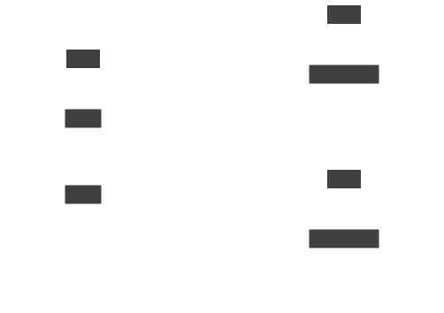
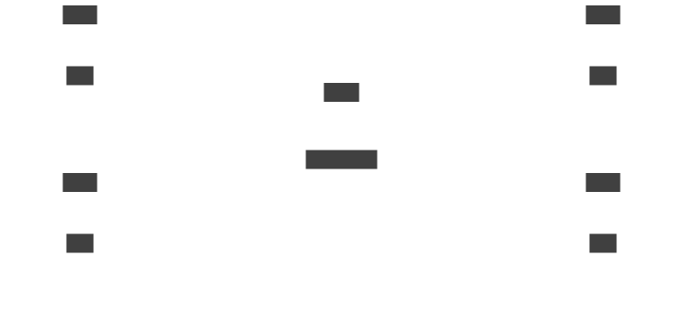

# Link concept

A link is a channel for communication between [sites](site.html).
Links carry application connections and requests.  A set of linked
sites constitutes a [network](network.html).

To create a link to a remote site, the remote site must enable
_link access_.  Link access provides an external access point for
accepting links.

<figure>
  
  <figcaption>The link model</figcaption>
</figure>

<figure>
  
  <figcaption>The link access model</figcaption>
</figure>

A site has zero or more links.  Each link has a host, port, and TLS
credentials for making a mutual TLS connection to a remote site.  In
addition, a site has zero or more link accesses.  Usually only one
is needed per site.  Each link access has a host, port, and TLS
credentials for exposing a TLS endpoint that accepts connections
from remote sites.

Application connections and requests flow across links in both
directions.  A linked site can communicate with any other site in
the network, even if it is not linked directly.  Links can be added
and removed dynamically.

You can use [access tokens](access-token.html) to securely exchange
the connection details required to create a link.

<figure>
  
  <figcaption>A link joining two sites to create a simple network</figcaption>
</figure>

<figure>
  
  <figcaption>A site with two links, to two remote sites</figcaption>
</figure>

<figure>
  
  <figcaption>A larger network with links to a central hub site</figcaption>
</figure>
