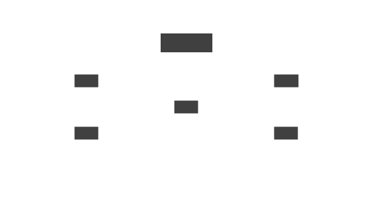

# Network concept

A network is a set of [sites](site.html) joined by
[links](link.html). A Skupper network is also known as an
application network or virtual application network (VAN).

<figure>
  
  <figcaption>The network model</figcaption>
</figure>

A network has one or more sites.  Each site belongs to only one
network.

Each site in the network can expose services to other sites in the
network. In turn, each site in the network can access those exposed
services.  Each network is meant for one distributed application.
This provides isolation from other applications and networks.

<figure>
  
  <figcaption>A simple network with two sites</figcaption>
</figure>

<figure>
  
  <figcaption>A larger network</figcaption>
</figure>
