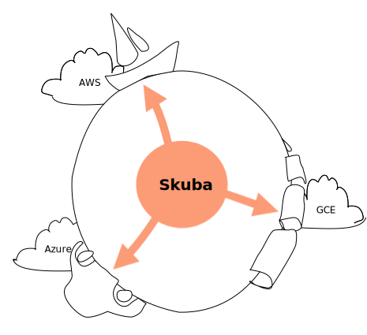

<header>
  

    

      {{circle(20)}}
      <a href="{{site_url}}/index.html" class="nameplate">Skuba</a>
    

    

       {{circle(20)}}
      <a href="https://github.com/skubaproject">GitHub</a>
    

  

</header>

<section id="-intro-section">
  

    <h1 class="nameplate">Skuba</h1>
    
    <h2>Multi-site, multi-cloud application networking for Kubernetes</h2>
    
{{lipsum_25}}

  

</section><svg id="-wave" height="6em" width="100%" xmlns="http://www.w3.org/2000/svg">
  <path d="M 0 0 L 0 50 Q 400 100, 800 50 T 1600 50 T 2400 50 T 3200 50 L 3200 0 Z" fill="#fff"/>
</svg>

<section>
  

    <iframe width="320" height="180" src="https://www.youtube.com/embed/AjPau5QYtYs" frameborder="0" allow="accelerometer; autoplay; encrypted-media; gyroscope; picture-in-picture" allowfullscreen></iframe>
    

      <h2>Connect multi-site services to a shared database</h2>
      
{{lipsum_25}}

    

  

</section>

<section>
  

    

      <h2>Load-balance API calls across clusters</h2>
      
{{lipsum_25}}

    

    <iframe width="320" height="180" src="https://www.youtube.com/embed/AjPau5QYtYs" frameborder="0" allow="accelerometer; autoplay; encrypted-media; gyroscope; picture-in-picture" allowfullscreen></iframe>
  

</section>

<section>
  

    <iframe width="320" height="180" src="https://www.youtube.com/embed/AjPau5QYtYs" frameborder="0" allow="accelerometer; autoplay; encrypted-media; gyroscope; picture-in-picture" allowfullscreen></iframe>
    

      <h2>Centrally manage your global application network</h2>
      
{{lipsum_25}}

    

  

</section>

<footer>
  

  

</footer>
